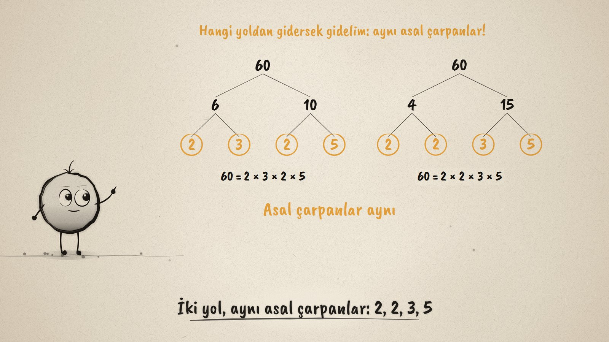
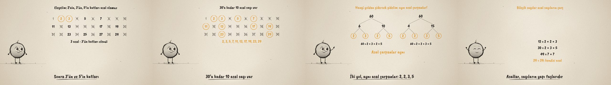

# Sayıların Yapı Taşları · Primes and Prime Factors

**▶ Tarayıcıda izleyin / Watch in the browser:** https://hakanatas.github.io/yapi-taslari/ 
**⬇ MP4 + altyazılar / MP4 + subtitles:** [Releases](https://github.com/hakanatas/yapi-taslari/releases) 
**✎ Kullanılan istem / The prompt behind it:** [PROMPT.md](PROMPT.md) 
**🎞 Bütün filmler / All films:** [Nokta'nın Filmleri](https://hakanatas.github.io/nokta-filmleri/?sinif=6)

> **TR —** 6. sınıf matematik "Sayılar ve Nicelikler" temasındaki MAT.6.1.3 öğrenme çıktısı için hazırlanmış, tamamen JavaScript ile çizilen 92 saniyelik mürekkep animasyonu. 7 ile 12 karşılaştırılarak asal sayı tanımlanıyor: yalnızca 1'e ve kendisine bölünen, tam iki çarpanı olan sayı. 1'den 30'a kadar sayılar bir tabloda eleniyor (Eratosthenes kalburu): 2'nin, 3'ün ve 5'in katları çiziliyor, geriye 10 asal kalıyor. Asal sayıların özellikleri tartışılıyor: 2 tek çift asal, 1 ne asal ne bileşik, asal olmayan sayılar bileşik. Sonra 60 iki farklı çarpan ağacıyla (6 × 10 ve 4 × 15) ayrılıyor; iki yol da aynı asal çarpanlara ulaşıyor: 60 = 2 × 2 × 3 × 5. 12, 30, 49 ve 29 ile bileşik sayıların asalların çarpımı olduğu gösteriliyor. Altyazılar Türkçe, İngilizce ya da ikisi birlikte seçilebilir.

A 92-second ink animation for **6th-grade maths**, drawn entirely with JavaScript on an HTML5 canvas. Nokta, the ink character from [The Learning Ink](https://github.com/hakanatas/the-learning-ink), is the guide again. Nothing about the primes is typed by hand: the sieve decides which cells get a ring and which get a cross (`isPrime`, `spf` in `src/draw/film.js`), and the factorizations in the last scene come from `factorize`.

## Learning outcome

MEB, Türkiye Yüzyılı Maarif Modeli, Ortaokul Matematik, 6th grade, "Sayılar ve Nicelikler" theme:

**MAT.6.1.3. Bir doğal sayının asal olma durumunu ve asal çarpanlarını çözümleyebilme**
- a) Bir doğal sayının asal olup olmadığını ve asal çarpanlarını belirler.
- b) Asal sayıların özelliklerini ve bir doğal sayı ile asal çarpanları arasındaki ilişkileri belirler.

## Scenes

| # | Time | Scene | What happens | Outcome |
|---|---|---|---|---|
| 1 | 0–10 s | Çok çarpan, az çarpan | 7 = 1 × 7, but 12 = 1 × 12 = 2 × 6 = 3 × 4. | a |
| 2 | 10–34 s | Eleme | Numbers 1–30: 1 is set aside, multiples of 2, 3 and 5 are crossed out; 7's are already gone. Ten primes remain. | a |
| 3 | 34–46 s | Özellikler | 2 is the only even prime, 1 is neither prime nor composite, 9 = 3 × 3 is composite, a prime has exactly 2 factors. | b |
| 4 | 46–70 s | Çarpan ağaçları | 60 = 6 × 10 and 60 = 4 × 15, split down to primes: both give 2 × 2 × 3 × 5. The prime factors of 60 are 2, 3 and 5. | a, b |
| 5 | 70–80 s | Yapı taşları | 12, 30, 49 split into primes; 29 is its own prime factor. Composites are products of primes. | b |
| 6 | 80–92 s | Aklında kalsın | Exactly 2 factors; 1 and 2; composites are products of primes; 60 = 2 × 2 × 3 × 5. | a, b |

## Running it

- **Preview:** double-click `index.html` (it works offline).
- **MP4:** run `npm install` once, then `npm run export -- --format=horizontal --captions=tr`.
- **Subtitles and narration:** `npm run srt` writes `out/captions_*.srt` and `narration_notes.txt`.
- **Editing:**
  - Caption text, timings and narration notes: `captions.js`
  - Everything on screen is drawn by `LI.world(t)` in `scenes/scene1.js` (the sieve, the timed lines, the two trees, the examples); the other scenes only set the camera.
  - The sieve timings (`ringT`, `crossT`), the factor tree, and Nokta's poses: `src/draw/film.js`; layout for 16:9 and 9:16: `src/draw/kd.js`

It uses the same engine as The Learning Ink: `renderFrame(t)` as a pure function of time, seeded randomness, and frame-by-frame export.
